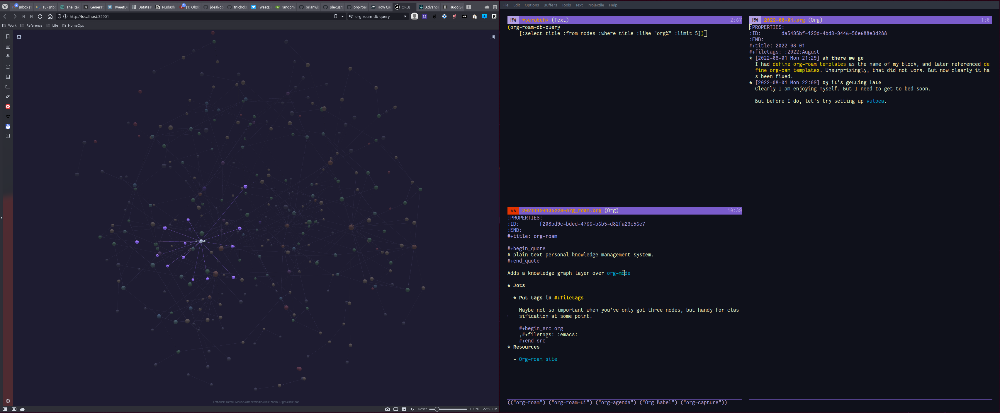

Continuing to get annoyed at Datalog for [queries][queries] in Logseq, when I
remembered [org-roam][org-roam] uses a SQLite database. Plus there's
[org-roam-ui][org-roam-ui], which — sheesh. It's impressive.

[queries]: https://docs.logseq.com/#/page/advanced%20queries
[org-roam]: https://www.orgroam.com
[org-roam-ui]: https://github.com/org-roam/org-roam-ui

<!--more-->

I have way too much sitting in my Logseq graph to just bounce, but it's good to
remember I have options.
